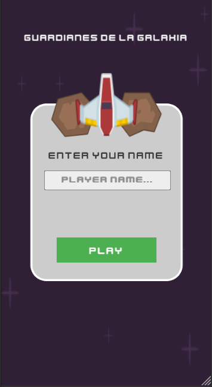
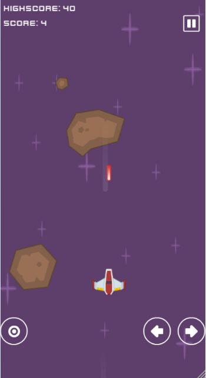
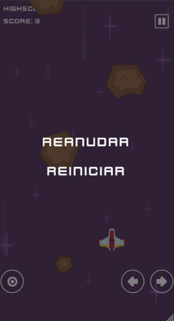
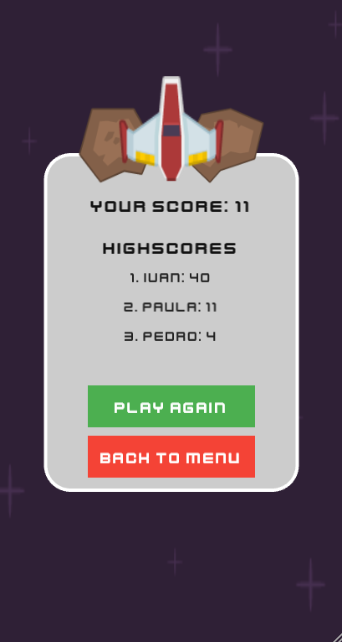

# 🚀 Guardianes de la Galaxia

**Guardianes de la Galaxia** es un juego de disparos arcade desarrollado con **Ionic**, **Angular** y el motor de videojuegos **Phaser**. El jugador controla una nave espacial que debe esquivar y destruir meteoritos mientras acumula la máxima puntuación posible.

---

## 🎮 Características del Juego

- Control de una **nave espacial** con movimiento libre.
- **Colisiones**, disparos y enemigos con físicas sencillas.
- **Música y efectos** de sonido integrados para una experiencia inmersiva.
- Guardado automático de los **puntajes más altos** usando `localStorage`.
- Escenas independientes para **inicio**, **pausa**, **partida** y **game over**, todas gestionadas con el sistema de escenas de Phaser.
- Interfaz adaptada a distintas resoluciones.

---

## 🛠️ Tecnologías Utilizadas

- **Phaser**: Motor de juegos 2D.
- **Angular + Ionic**: Framework para desarrollar aplicaciones web y móviles híbridas.
- **TypeScript**: Lenguaje usado para mejorar la robustez del código.
- **HTML5 & CSS3**: Estructura y estilos.
- **Web APIs** como `localStorage` para persistencia de datos.

---

## 💡 Aspectos Técnicos Destacados

- Uso eficiente de **Phaser.Scene** para encapsular la lógica de cada etapa del juego (`StartScene`, `GameScene`, `PauseScene`, `GameOverScene`).
- Persistencia de datos de usuario con `localStorage`, incluyendo el ranking de **top 3 puntuaciones**.
- Interfaz gráfica personalizada con **botones interactivos**, paneles dibujados dinámicamente con `Graphics`, y uso de `setInteractive()` para manejo de eventos.
- Reproducción de **audio en bucle** y control manual del mismo al cambiar de escena (`music.stop()`).
- Diseño modular que permite escalar o migrar el juego fácilmente a otras plataformas (por ejemplo, como app móvil con Ionic).

---

## 🧪 Capturas de Pantalla

> *(Puedes sustituir los siguientes ejemplos por imágenes reales del juego una vez subidas al repositorio o servicio externo como Imgur o GitHub)*

### Pantalla de Inicio  


### Juego en Curso  


### Pausa  


### Fin de Juego  


---

## 📦 Instalación y Ejecución

1. Clona el repositorio:
```bash
git clone <URL_DEL_REPOSITORIO>
cd guardianes-de-la-galaxia```

2. Instala dependencias:
```bash
    npm install```
3. Inicia la aplicación en desarrollo:
```bash
ionic serve```

---

## 🧑‍🎨 Créditos

- Space Shooter (Redux, plus fonts and sounds) by Kenney Vleugels (www.kenney.nl)
- cynicmusic.com - pixelsphere.org
- soundcloud.com/laserost - youtube.com/user/Manofunctional
- mobeyee.com